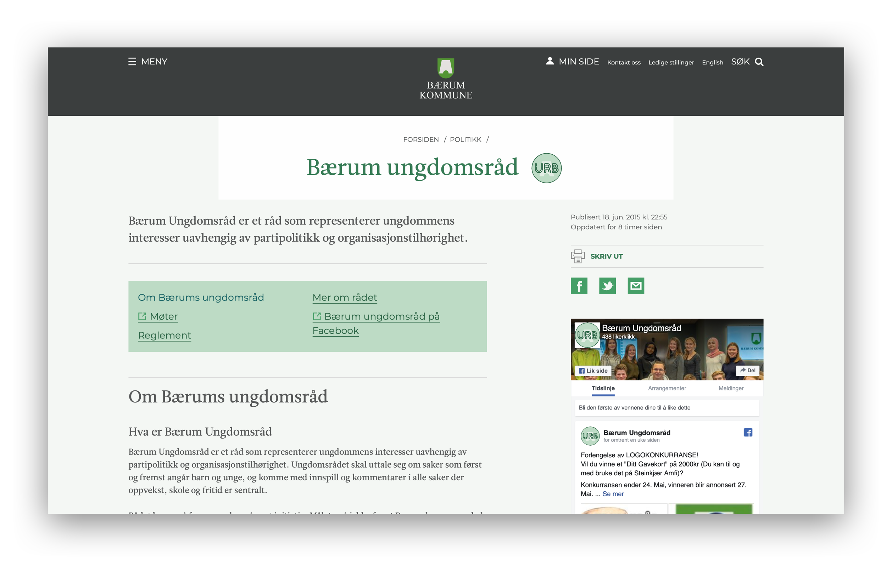
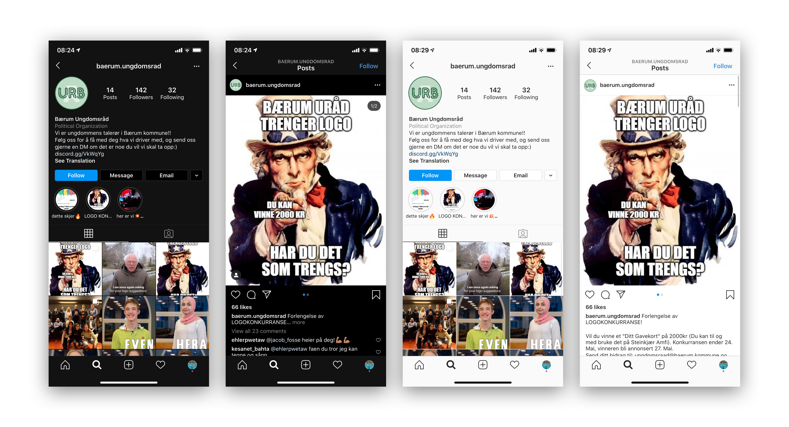

# URB-Logokonkurranse
Mitt bidrag til logokonkurransen

I denne mappen vil dere finne de to forskjellige versjonene av logoen i flere størrelser, kildefilene (.svg og .sketch) og demoer for å se hvordan logoen vil se ut på nettsiden, på facebook-siden og instagram-profilen deres.

Begge logoene har samme design, men bruker forskjellig font. Fargene på logoet er de samme som på nettsiden deres, så de vil passe rett inn.
Om dere liker designet men har noen endringer å bidra med, så er dere velkomne til tilpasse det (jeg legger med .svg og .sketch filene slik at dere enkelt kan redigere det).
For begge versjonene av logoet har jeg lagd en forhåndsvisning av hvordan det vil passe inn på nettsiden deres, Instagram-profilen deres og Facebook-siden deres.

# Logo v1
I denne versjonen er fonten brukt 'Neon One' med litt ekstra tykkelse. Den kan lastes ned gratis fra https://www.pixelsurplus.com/freebies/neon-one-free-neon-style-font. 

# Logo v2
I denne versjonen er fonten brukt samme som på nettsiden deres, 'Leitura News'. 

