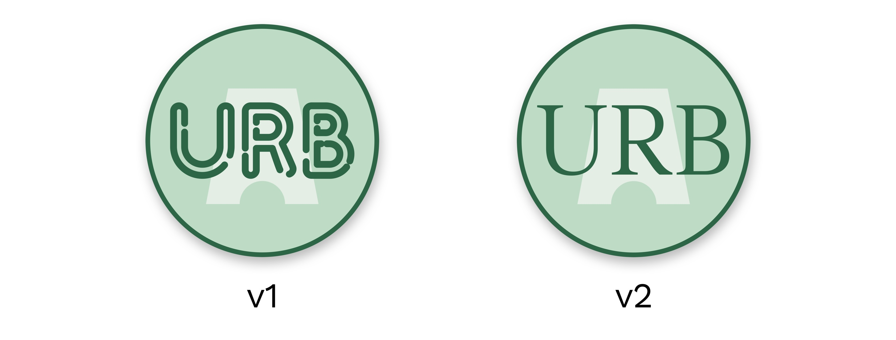
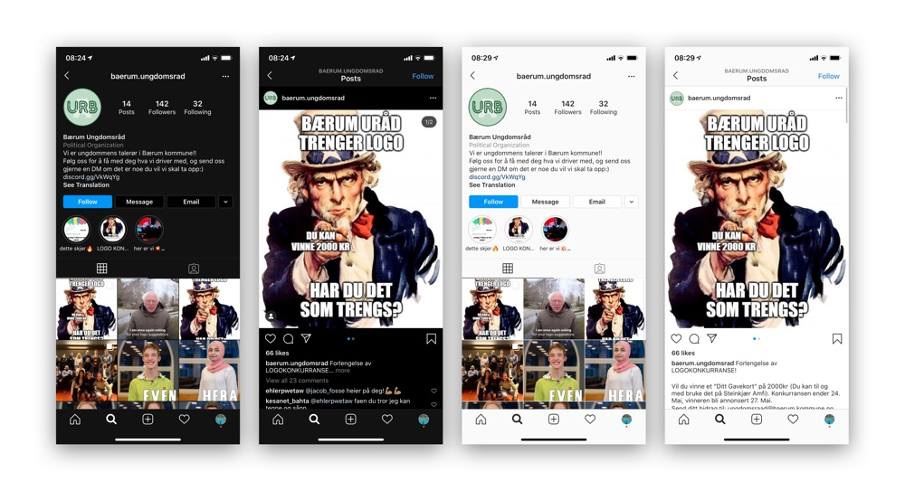
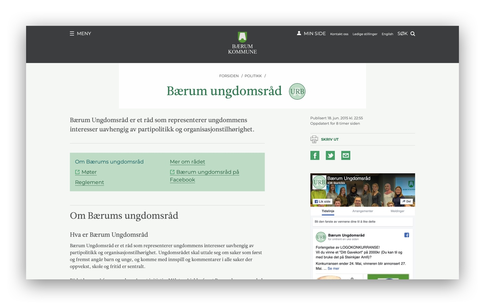

# URB-Logokonkurranse
Mitt bidrag til logokonkurransen

Begge logoene har samme design, men bruker forskjellig font. Fargene på logoet er de samme som på nettsiden deres, så de vil passe rett inn.
Om dere liker designet men har noen endringer å bidra med, så er dere velkomne til tilpasse det (jeg legger med .svg og .sketch filene slik at dere enkelt kan redigere det).
For begge versjonene av logoet har jeg lagd en forhåndsvisning av hvordan det vil passe inn på nettsiden deres og Instagram-profilen deres både i dark mode og light mode.

# Logo v1
I denne versjonen er fonten brukt 'Neon One' med litt ekstra tykkelse. Den kan lastes ned gratis fra https://www.pixelsurplus.com/freebies/neon-one-free-neon-style-font. 

# Logo v2
I denne versjonen er fonten brukt samme som på nettsiden deres, 'Leitura News'. 

# Hvordan laste ned
For å laste ned filene trykker du på den grønne knappen på toppen av siden der det står 'clone or download repository'.
